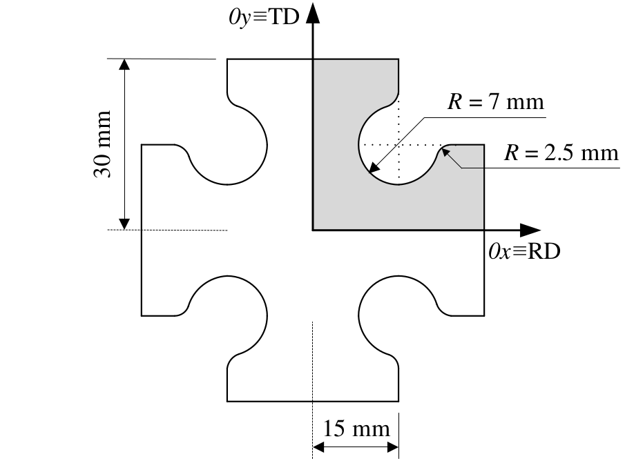
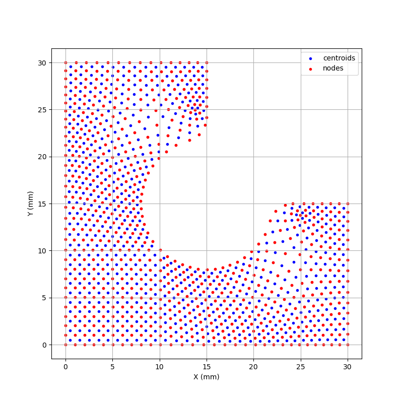
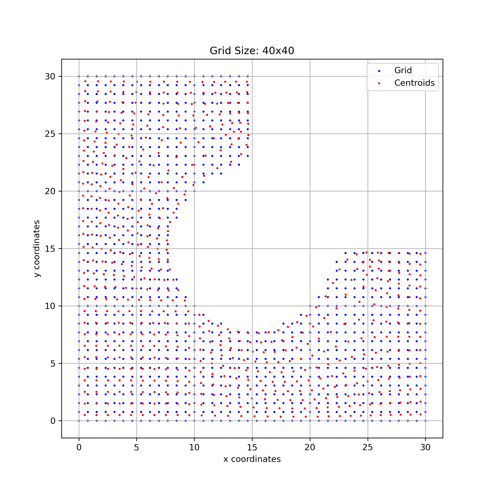

# MLCCM
**Machine Learning** for **Calibration** of **Constitutive Models**

***

## Background
### Main purpose
Based on previous scientific researches<!-- (see [bibliography](#bibliography)) -->, this project aims to study Abaqus integration point data interpolation into well defined and equally spaced mesh grid points.

### Previously
For this case study, only 1/8 of the cruciform shape is considered in the simulation, which is equivalent to final dimensions of 30x30x0.5 mm.

<!-- image of the mesh elements and reduced integration points -->

<!-- cruciform dimensions sketch image -->
<p align="center">
  
</p>

Simulation mesh has 564 C3D8R elements created across the considered thickness (0.5 mm), each one represented by its reduced integration point (centroid) positioned in the middle of the thickness.

<!-- 2D grid interpolation points -->
<p align="center">
  
</p>

Knowing all the centroids coordinates for each simulation timestep allows us to interpolate $\epsilon_{xx}$, $\epsilon_{yy}$ and $\epsilon_{xy}$ values for the defined grid points.

### Why integration point data interpolation into a structured mesh grid?
Finite element simulation data is inherently tied to integration points, which are distributed according to the mesh used in the simulation.
By other words, we can say that the obtained results are mesh dependent.
But, what if we want to know data in different points other than the ones given by the simulation mesh?
Well, interpolating integration point data into a structured mesh grid addresses this challenge!

### Interpolation and its context
Interpolation is a fundamental mathematical technique used to estimate unknown values between known data points.
In the context of material parameter prediction through machine learning (ML) using simulation data, interpolation helps create a continuous representation of discrete data obtained from finite element integration points.
This representation is essential when mapping simulation results onto a desired structured grid, enabling smoother and more precise data analysis.

In this project, Python's `scipy.interpolate` library is used, specifically the `RBFInterpolator` (Radial Basis Function Interpolator) class.
The `scipy.interpolate` library is a part of the SciPy ecosystem, which provides a collection of mathematical algorithms and convenience functions built on NumPy.
It is widely used for performing interpolation tasks, including both univariate and multivariate data interpolation, with support for regular and scattered datasets.

This choice is motivated by the library's robustness, flexibility, and the efficient implementation of its various interpolation methods in the context of this work.
`RBFInterpolator` is particularly suited for scattered data interpolation, where data points are irregularly distributed in space.
It also supports extrapolation, which is a crucial feature for this use case, as not all interpolation methods provide this capability.

Previously, `griddata` class (from the same library) was also explored, which is also part of the **Multivariate Interpolation** family.
However, `griddata` does not support extrapolation, which limited its applicability for this work, making the `RBFInterpolator` class the preferred choice.

### Choosed interpolation methods and grids

The choosed interpolation methods are the following:

* ```linear:``` A computationally efficient method that assumes a piecewise linear relationship between data points. It is fast and works well for datasets where smoothness is less critical:\
```-r```

* ```cubic:``` Provides a smoother interpolation by using cubic radial basis functions. It balances smoothness and computational cost:\
```-r**3```

* ```multiquadric:``` It introduces a radial function that grows quadratically, allowing it to handle complex datasets with non-uniform point distributions effectively:\
```-sqrt(1 + r**2)```

Considering cruciform external dimensions (30x30 mm), a grid can be defined inside a bounding square with a certain number of points inside of it.
However, from the total number of generated points, only some are inside the cruciform area (domain).
This way, 3 grids are considered:

* **20x20**: total of 400 points, 253 inside the cruciform domain (~63.3%)

<!-- 2D grid interpolation points -->
<p align="center">
  
</p>

* **30x30**: total of 900 points, 564 inside the cruciform domain (~62.6%)

<!-- 2D grid interpolation points -->
<p align="center">
  
</p>

* **40x40**: total of 1600 points, 1006 inside the cruciform domain (~62.9%)

<!-- 2D grid interpolation points -->
<p align="center">
  
</p>

### Methodology

In total, there are 9 possible combinations to test and evaluate. All interpolations are performed using previously processed X datasets, with 2000 simulations for training and 260 simulations for testing.
The chosen machine learning (ML) architecture is XGBoost, and the models are trained and tested using all the different interpolated datasets.

### Performance evaluation

To assess the quality of the obtained interpolations, the results are evaluated by performing a "reverse interpolation", where the interpolated data (grid) is mapped back to the original points (centroids).

<!-- plot with explained results -->

<!-- "re-interpolation" back to integration points -->
<!-- predicted vs original parameter comparison -->
<!-- global statistics and analysis -->

<!-- ### Which one should I choose? -->
<!-- ### Bibliography -->

## Setup

### Clone

Open terminal, change your current working directory to the location where you want the cloned directory and then clone this repository to your local machine

```
git clone https://github.com/dmitreiro/MLCCM.git
```

### Config

Inside your repository home folder, edit ```config/config.ini``` file to define your paths.

### Environment

Next, install **Anaconda** for managing your Python environments. You can check documentation [here](https://docs.anaconda.com/anaconda/install/).\
After the installation, create an empty environment using **Python 3.11.10**

```
conda create --name <your_env_name> python=3.11.10
conda activate <your_env_name>
```

Then, navigate to your repository home folder and install dependencies

```
pip install -r requirements.txt
```

### Run your code

Now, you are ready to rock :sunglasses:\
Just run

```
python main.py
```

## License

This project is licensed under the MIT License, which allows anyone to use, modify, and distribute this software for free, as long as the original copyright and license notice are included. See the [LICENSE](LICENSE) file for more details.